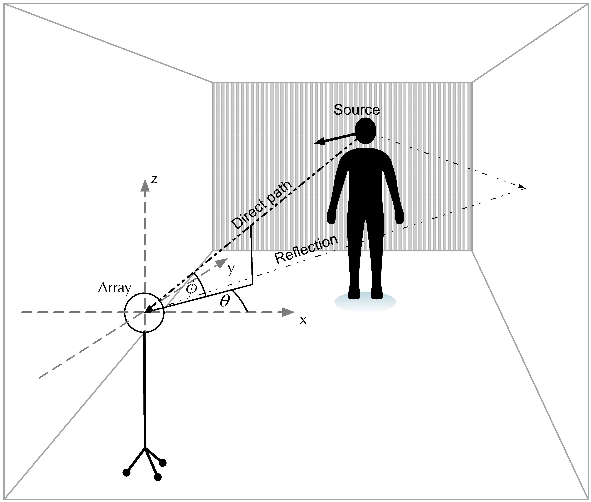
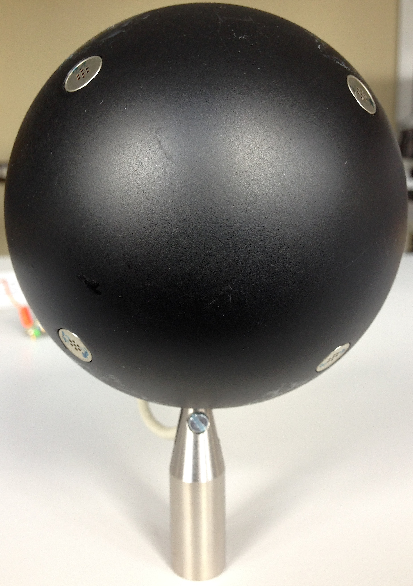
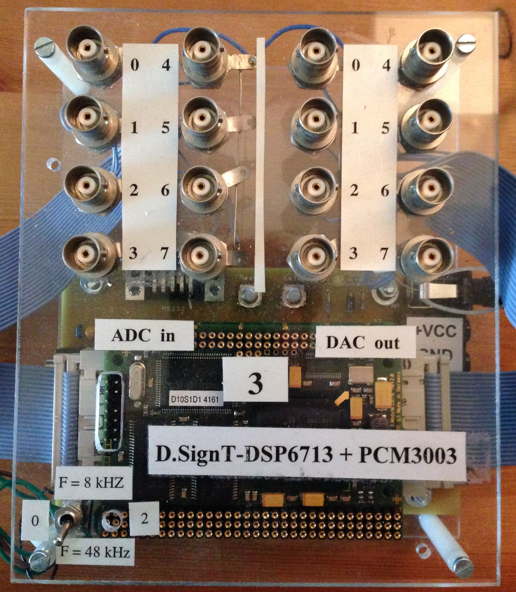

- [Acoustic localisation of a speaker source in a reverberant environment](#acoustic-localisation-of-a-speaker-source-in-a-reverberant-environment)
  - [Problem formulation](#problem-formulation)
  - [Objective](#objective)

# Acoustic localisation of a speaker source in a reverberant environment
...

## Problem formulation

This project deals with the design, the simulation and the implementation of a digital real-time system for the localization of a moving speech source within a closed room. The aim is to create an algorithm based on
appropriate estimation method the direction (horizontal and vertical angle)
this signal source, referred to a reference coordinate system,
determined (). As the underlying theoretical approach to determining
the direction of sound incidence (DOA[^1]) of a source signal are here
the runtime differences (TDOA[^2]) between the individual microphones
as well as the known geometry of the microphone array[^3]. One
graphic representation should ultimately be done by means of serial transmission
estimated results can be realized on a display device.

 
Main Hardware Components

[^1]: Direction Of Arrival

[^2]: Time Difference Of Arrival

[^3]: Microphone array

## Objective

On the basis of the problem stated below, the following objectives to be met by the
system can be defined:

1. ability to process broadband signals such as speech

2. ability to detect the spatial direction of the source with sufficient
    sufficiently high accuracy (horizontal as well as vertical angle)

3. ability to operate in environments with a high noise floor and/or
    reflection coefficient

4. ability to process data in real time

The term "real-time" can be defined as follows:  

With regard to a later implementation with the use of a digital signal
With regard to a later implementation using a digital signal processor, the following requirements can be
the following requirements can be specified in order to ensure proper functioning of the overall system
of the overall system:

1. processing of speech signals up to an upper cut-off frequency
    of $f_{max} = 3 kHz$

2. robust tracking of a speech source within a defined
    angular space:

    - Azimuth: $0° \leq \theta < 360°$

    - Elevation: $-90° < \phi < 90°$

3. the duration of the data processing shall be equal to or less than the
    data recording duration. Consequently, the condition
    $T_{Processing} \leq T_{Frame}$ must be permanently fulfilled.

4. the process of data collection and data processing must necessarily take place
    take place concurrently.

5. to ensure the continuity of the results, there must be a continuous flow of data between input and output.
    between the input and output interfaces must be guaranteed.
    be guaranteed.

 
Multichannel Cross-Correlation Coefficient Algorithm

